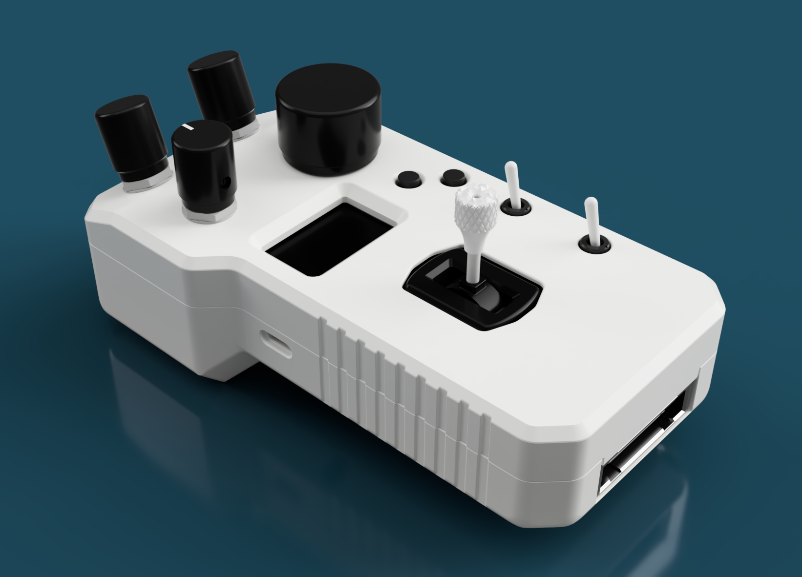

Mini-Remote Controller Hardware
===============================

Description
-----------
This repository contains the main production files and other 3D files related to the MiniRemote project.

The code for this device is also open-source. You can find it <a href="https://github.com/basecamelectronics/sbgc32-serial-api/tree/master/examples/STM32/MiniRemote">here</a>
.
This folder contains a <a href="https://github.com/basecamelectronics/sbgc32-serial-api/tree/master/examples/STM32/MiniRemote/MiniRemoteDescription.pdf">document</a>
 with a more detailed description of the project.

Files Description
-----------------

[3D_Models/](3D_Models) - a folder with .step and .stl PCB 3D files;

[Enclosure/](Enclosure) - 3D models of the MiniRemote's casing and joysticks;

[PCB/](PCB) - the general manufacture files and sources;

[changelog.txt](changelog.txt) - a project changelog;

[MiniRemoteAccessories.xlsx](MiniRemoteAccessories.xlsx) - BOM for enclosure assembly;

Feedback
--------

If you have any questions or suggestions about using MiniRemote, you can contact at:

support@basecamelectronics.com

a.ivanisov@basecamelectronics.com